# BunnyBet Casino
A comprehensive online casino web application built with Node.js/Express, React.js/Redux, and HTML Canvas

## Project Overview

BunnyBet is a full-featured online casino platform offering multiple gambling games. The project combines a robust backend with a dynamic frontend to deliver an immersive gaming experience.

### Key Features:
- **Roulette**: Realistic wheel physics and betting interface
- **Blackjack**: Classic 21 with various rule sets
- **Slot Machines**: Animated reels with winning combinations
- **Craps**: Dice rolling game with complex betting options
- **Poker**: Both 5-card draw and Texas Hold'em variants
- **Baccarat**: Classic card game with elegant interface
- **Keno**: Lottery-style number drawing game
- **Race Betting**: Virtual horse racing with betting system

### Technologies Used:
- **Backend**: Node.js, Express.js framework
- **Frontend**: React.js with Redux state management
- **Graphics**: HTML Canvas for game rendering
- **Database**: (specify your database)
- **Authentication**: JWT token-based system
- **Payments**: Stripe and Google Pay integration

## Getting Started

### Prerequisites
- Node.js (version 14 or higher)
- npm or yarn package manager
- Database system (specify which one you use)

### Installation
```bash
# Clone the repository
git clone https://github.com/developer3000S/casino.git

# Install dependencies
npm install
```

### Running the Application
```bash
# Production mode
npm start

# Development mode with hot reloading
npm run dev
```

### Demo Access
**Login Email**: oanapopescu93@gmail.com  
**Password**: test123

## Project Structure

```
bunnybet-casino/
├── client/              # Frontend (React application)
├── server/              # Backend (Node.js/Express)
│   ├── controllers/     # Request handlers and business logic
│   ├── models/          # Database models and schemas
│   ├── routes/          # API endpoint definitions
│   ├── middleware/      # Custom middleware functions
│   ├── payments/        # Payment processing system
│   └── images/          # Images for documentation
├── config/              # Configuration files
└── README.md           # Project documentation
```

## Security

All API secrets (including Stripe keys) should be stored in environment variables and never committed to the repository.

### Environment Variables:
- `STRIPE_SECRET_KEY` - Stripe secret key for payment processing
- `JWT_SECRET` - Secret key for JWT token signing
- `DB_CONNECTION` - Database connection string
- `PORT` - Server port (default: 3000)

Create a `.env` file in the root directory with these variables.

## Screenshots

### Screenshot 00 - Splash Screen


### Screenshot 01 - Main Lobby (Homepage)
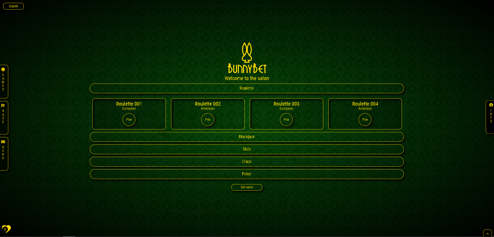

### Screenshot 02 - Roulette Wheel and User Panel
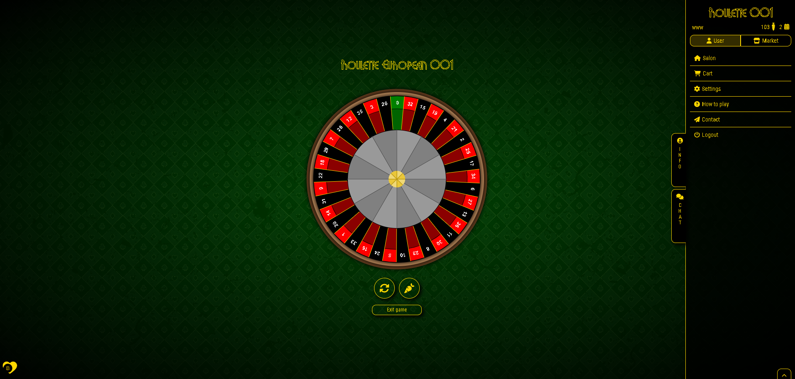

### Screenshot 03 - Roulette Board and Chat Panel
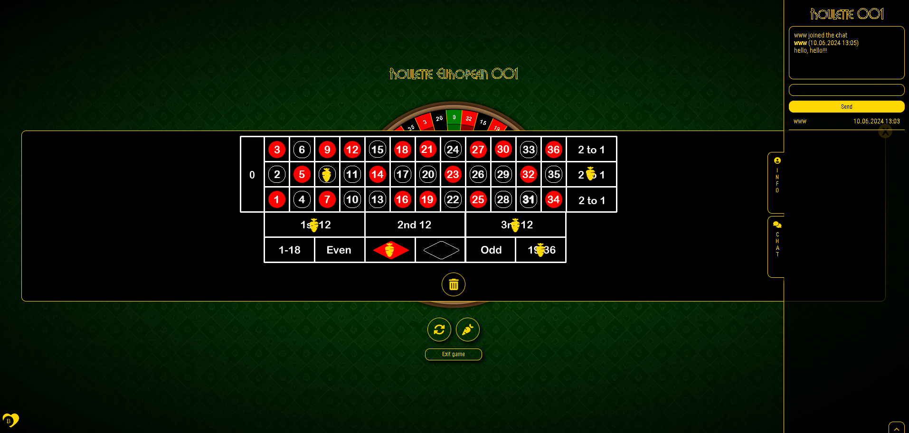

### Screenshot 04 - Texas Hold'em Poker
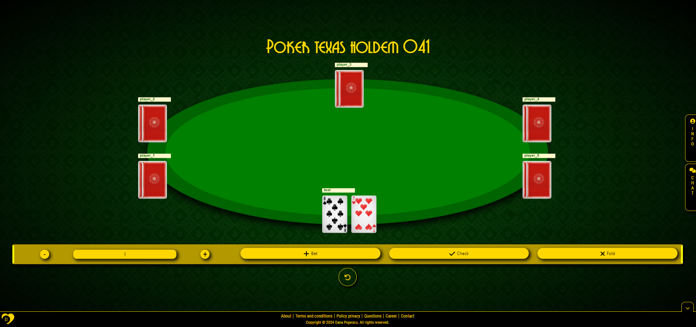

### Screenshot 05 - Race Betting 01
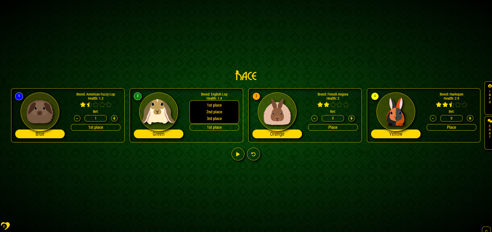

### Screenshot 06 - Race Betting 02
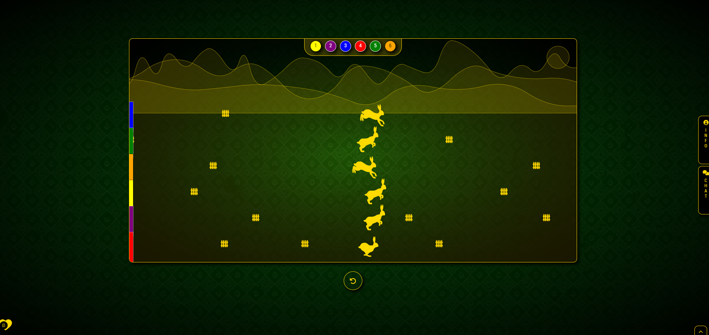

### Screenshot 07 - Market/Shop
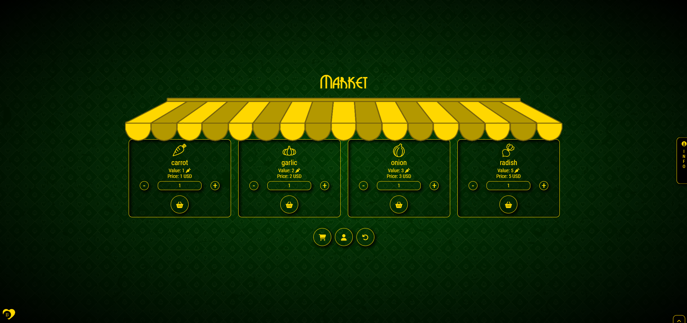

### Screenshot 08 - User Dashboard
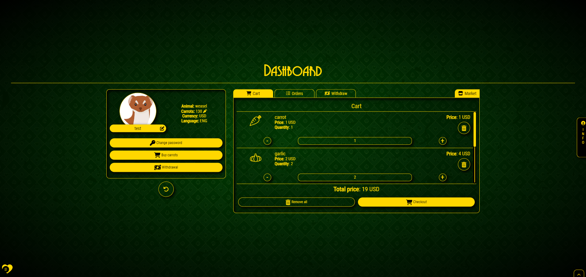

### Screenshot 09 - Checkout Process
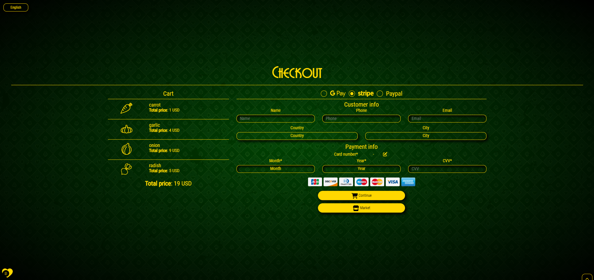

### Screenshot 10 - Contact Page
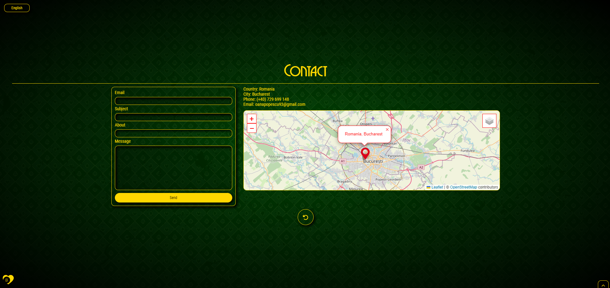

### Screenshot 11 - Database Structure
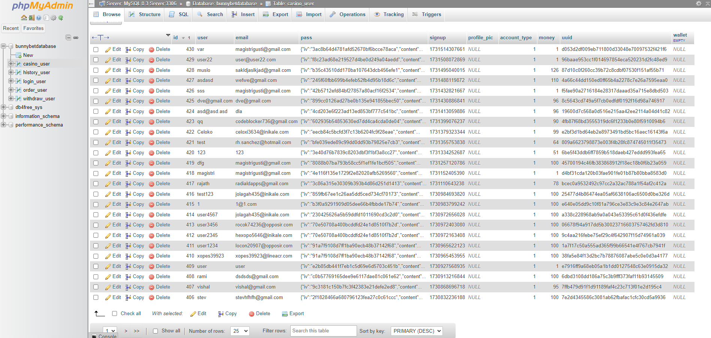

## Development

### Application Architecture

The backend follows a REST API architecture with clear separation of concerns:
1. **Routes** - Define API endpoints
2. **Controllers** - Contain business logic
3. **Models** - Handle database operations
4. **Middleware** - Process requests before controllers

### Game Mechanics

All games are implemented using HTML Canvas for rendering and JavaScript for game logic. Each game features:
- Realistic physics (roulette wheel, dice rolling)
- Fair random number generation
- Real-time multiplayer support

## Payment System

Integrated payment system with Stripe supporting:
- Credit and debit card processing
- Google Pay integration
- Automatic transaction handling
- Secure payment information storage

## Security Measures

- All sensitive data is encrypted
- Passwords are hashed using bcrypt
- JWT tokens for session management
- Input validation and sanitization
- Rate limiting to prevent abuse
- CORS protection

## API Documentation

### Authentication Endpoints
- `POST /api/auth/login` - User login
- `POST /api/auth/register` - User registration
- `GET /api/auth/logout` - User logout

### Game Endpoints
- `GET /api/games` - List all available games
- `POST /api/games/roulette/bet` - Place roulette bet
- `POST /api/games/blackjack/deal` - Start blackjack game
- `POST /api/games/slots/spin` - Spin slot machine

### User Endpoints
- `GET /api/user/profile` - Get user profile
- `PUT /api/user/profile` - Update user profile
- `GET /api/user/balance` - Get user balance
- `POST /api/user/deposit` - Deposit funds
- `POST /api/user/withdraw` - Withdraw funds

## Contributing

We welcome contributions to improve BunnyBet Casino. To contribute:

1. Fork the repository
2. Create a feature branch
3. Commit your changes
4. Push to the branch
5. Open a Pull Request

Please ensure your code follows our coding standards and includes appropriate tests.

## License

This project is licensed under the MIT License - see the [LICENSE.md](LICENSE.md) file for details.

## Support

For support, please open an issue on GitHub or contact us at oanapopescu93@gmail.com